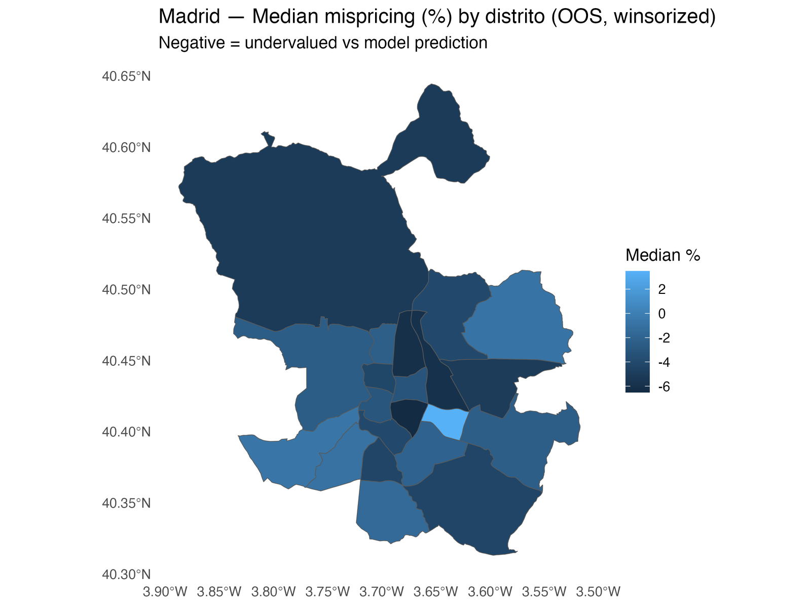
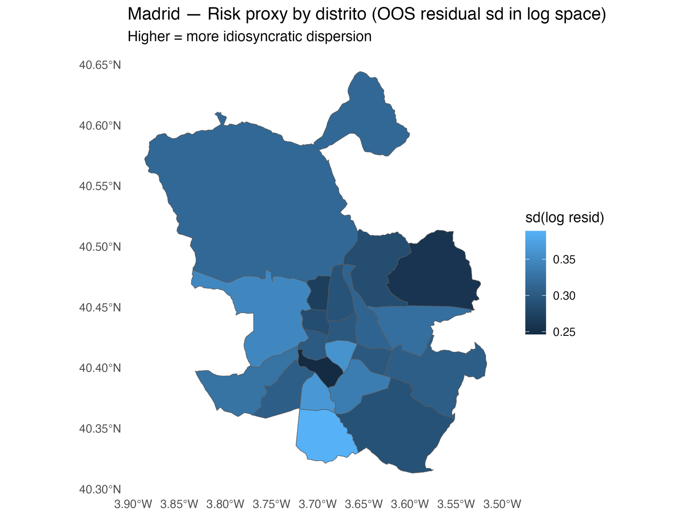
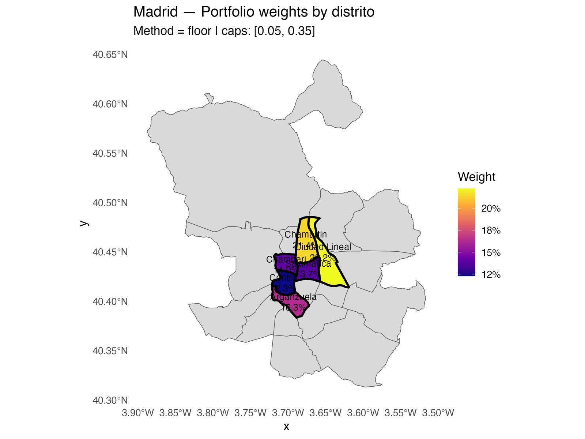
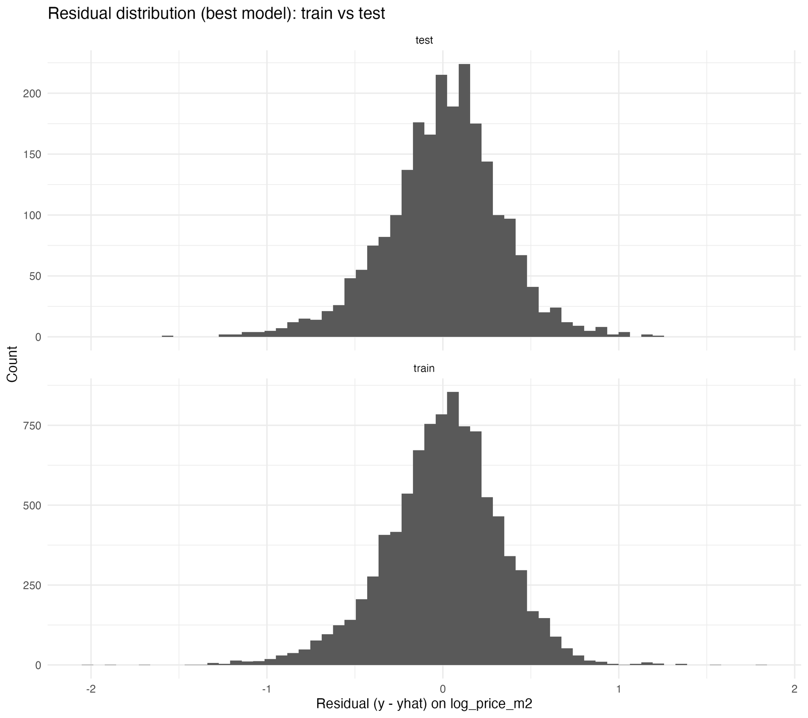
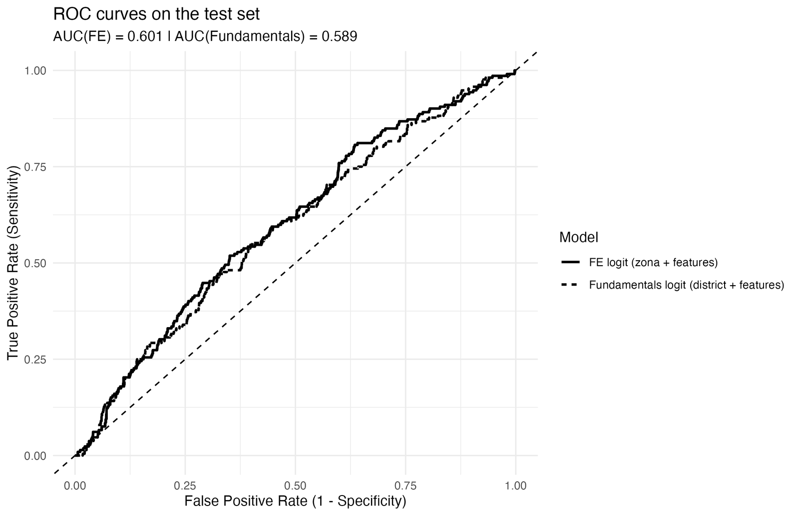

# Madrid Residential Real Estate Intelligence

**A Data-Driven Framework for Investment Analysis, Predictive Modelling, and Acquisition Screening**

Abdullah Tadmuri | Master in Computational Social Science | UC3M | 2025-2026

## Overview

A complete analytical framework for the Madrid residential property market, built on 11,826 active listings and integrated with official district-level data, municipal amenity counts, and published market benchmarks (January 2026). The system covers twelve analytical phases: from data ingestion to acquisition recommendations.

This is not a single model — it is an end-to-end investment intelligence pipeline that a real estate investor can configure with their own portfolio data.

## What It Does

| Phase | Description |
|---|---|
| 1-2 | Data ingestion, cleaning, and feature engineering (11,826 listings) |
| 3 | Exploratory market analysis with district-level benchmarking |
| 4-7 | Four classical statistical models (OLS, Fixed Effects, Pooled, LMM) |
| 8-9 | Three regularization models (LASSO, Ridge, Elastic Net) + two ML models (Random Forest, XGBoost) |
| 10 | Automated valuation and mispricing detection |
| 11 | District-level price forecasts (2026-2027) with scenario analysis |
| 12 | Portfolio intelligence framework with configurable investor portfolio |
| 13 | Motivated-seller classification (logistic regression + calibration) |

## Key Results

- **Best model:** XGBoost (R2 = 0.74, MAE = 1,180 euros/m2)
- **District ICC:** 64% of price variance is between-district (LMM finding)
- **Lift premium:** +22.3% price impact (largest structural feature)
- **Mispricing detection:** identifies top-20 undervalued listings per district
- **Forecast:** 3 scenarios (bear/base/bull) across 21 districts through 2027
- **Seller classification:** AUC 0.62 for motivated-seller probability scoring

## Technical Stack

**Languages:** R (Quarto)

**Modelling:**
- Classical: OLS, Fixed Effects, Pooled OLS, Linear Mixed Models (lme4)
- Regularization: LASSO, Ridge, Elastic Net (glmnet)
- Machine Learning: Random Forest (ranger), XGBoost (xgboost)
- Classification: Logistic Regression with calibration curves

**Packages:** tidyverse, tidymodels, glmnet, ranger, xgboost, lme4, lmerTest, sandwich, lmtest, sf, pROC, vip, modelsummary, gt, plotly, patchwork

**Visualization:** ggplot2, plotly, sf (spatial maps), patchwork (multi-panel)

## Project Structure

```
.
├── Madrid_RE_Analysis.qmd              # Main analysis (3,200 lines, 12 phases)
├── Madrid_RE_Results_Report.md         # Full interpretation report
├── styles.css                          # Custom HTML styling
├── Fig_cls_Calibration_test_FE_vs_Fund.png  # Calibration plot
├── Fig_cls_ROC_test_FE_vs_Fund.png          # ROC curve
├── README.md
└── .gitignore
```

## Selected Results

### District-Level Mispricing Detection

Median mispricing (%) by district, computed out-of-sample. Negative values indicate districts where listings are priced below model predictions (potential undervaluation).



### Risk Proxy by District

Idiosyncratic price dispersion (residual standard deviation in log space) across Madrid districts. Higher values signal greater pricing uncertainty.



### Portfolio Construction

Optimal district-level portfolio weights derived from the investment scoring framework. Highlighted districts form the recommended shortlist, with weights capped at [5%, 35%].



### Model Validation: Residual Distribution

Train vs. test residual distributions for the best hedonic model, confirming no overfitting and approximately normal error structure.



### Motivated-Seller Classification: ROC Curve

ROC curves comparing Fixed-Effects logit against a Fundamentals-only logit on the held-out test set. The FE model achieves AUC = 0.601.



## How to Use With Your Own Data

1. Replace the listing data path in Phase 1 with your own property dataset
2. Replace the demo portfolio in Phase 12 with your own building holdings
3. Update district benchmark prices in the forecast section
4. Render: `quarto render Madrid_RE_Analysis.qmd`

The framework is designed to be modular — each phase reads from the previous phase's output, so you can modify individual components without breaking the pipeline.

## Data Sources

| Source | Coverage | Role |
|---|---|---|
| Public listing platform | 11,826 Madrid listings (Jan 2026) | Primary dataset |
| National appraisal index | District-level benchmarks (2025) | External validation |
| INE (National Statistics) | District income and population | Socioeconomic controls |
| Madrid Open Data | Amenities (parks, museums, schools, libraries) | Location features |

Raw data is not included in this repository due to licensing restrictions. The analysis is fully documented and reproducible with equivalent listing data.

## License

Academic project — UC3M, 2026.
